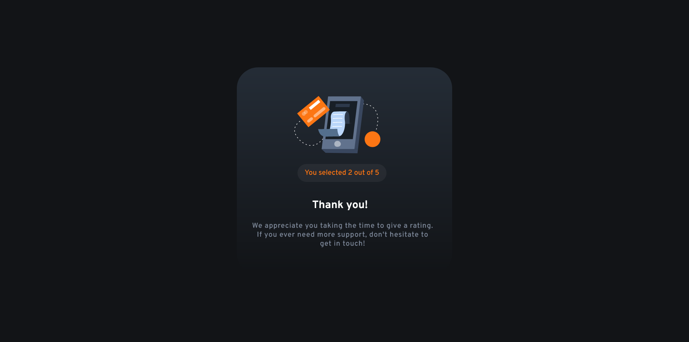

# Frontend Mentor - Interactive rating component solution

This is a solution to the [Interactive rating component challenge on Frontend Mentor](https://www.frontendmentor.io/challenges/interactive-rating-component-koxpeBUmI). Frontend Mentor challenges help you improve your coding skills by building realistic projects. 

## Table of contents

- [Overview](#overview)
  - [The challenge](#the-challenge)
  - [Screenshot](#screenshot)
- [My process](#my-process)
  - [Built with](#built-with)
  - [What I learned](#what-i-learned)
  - [Continued development](#continued-development)
- [Author](#author)

## Overview

### The challenge

Users should be able to:

- View the optimal layout for the app depending on their device's screen size
- See hover states for all interactive elements on the page
- Select and submit a number rating
- See the "Thank you" card state after submitting a rating

### Screenshot

## My process

### Built with

- HTML
- CSS
- JavaScript

### What I learned

I tested my skills using HTML, CSS and JavaScript and discovered that I have too much to improve.

### Continued development

In my next project I will improve my learnings about responsiveness. I think that I want to be better at positioning elements on the screen so I need to learn about Flexbox and Grid Skills.

## Author

- Linkedin: [Davi Gazola](https://www.linkedin.com/in/davi-gazola/)